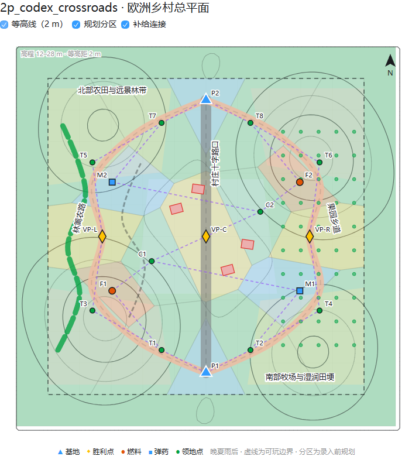

# 2p_codex_crossroads

这是正式命名为 `2p_codex_crossroads` 的 COH2 1v1 灰盒地图项目。

## 当前状态

- 已完成：尺寸、双人起点、三路、3 VP、2 油、2 弹药、10 个标准领地点的数据草案。
- 已完成：点位边界、数量、双边 180 度机会对称和路线数量的后台检查。
- 未完成：World Builder `.sgb`、实际领地绘制、起始包、交互边界、路径网格、场景产物和游戏内对局。

本目录目前还不是可运行地图。`layout.json` 使用以地图中心为原点的规划坐标；实际录入 World Builder 前仍需核对编辑器坐标与地形原点。

## 文件

- `layout.json`：灰盒规划数据。
- `graybox-blueprint.svg`：俯视规划图。
- `terrain-sector-plan.json`：等高线、分区、补给连接与氛围方向数据。
- `terrain-sector-masterplan.png`：包含等高线、点位、规划分区和补给关系的总平面预览。
- `acceptance-progress.md`：按项目验收规范记录的当前进度。

