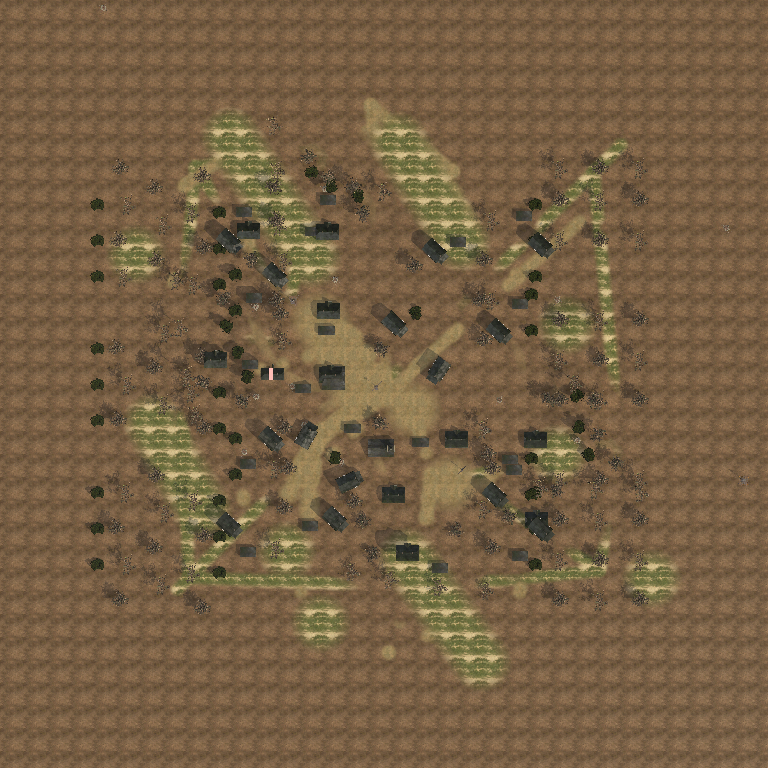

# 2p_codex_crossroads

COH2 1v1 欧洲小镇战斗地图。当前唯一续作入口是 `scenario/2p_codex_crossroads_rebuild_v6.sgb`；仓库保存 World Builder 生成的完整九文件同名 bundle，`package/2p_codex_crossroads_rebuild_v6.sga` 是与该源文件同轮生成的封包。

## v6 修复结果

- 保留约 10–14 m 连续地形层级，以低地、镇区台地和侧翼高地形成战术高差。
- 清理旧环路残留，改为一条连续主干、两侧支路和乡间连接路，入口与交界更清晰。
- 场景共 247 个实体；新增 112 个正式 elm、hedge、shed 资产，形成边缘树带、道路林荫、林篱分区和镇区附属建筑。
- 地表不再使用单一泥土色：以基础土、草地/农田、泥泞鹅卵石道路与镇区硬地形成三类可辨区域语言。
- 使用正式 Ardennes Rural 建筑、棚屋、树列与林篱，不使用占位方块。
- 保留 19 个连续领地区、3 VP、2 油、2 弹药、10 个普通领地点，以及双方完整出生包和 entry point。
- `.sga` 已通过 `Archive.exe -t`，归档内九文件尺寸与当前 v6 源 bundle 一致。

## 证据

- `evidence/overhead-v6.png`：当前全局路网、镇区和植被分布。
- `evidence/height-v4-contrast.png`：高度图对比增强图。
- `evidence/runtime-v4-tactical.jpg`：游戏内战术地图、出生与领地证据。
- `evidence/runtime-v4-town.jpg`：中央小镇实机视图。
- `evidence/runtime-v4-highland.jpg`：侧翼高地与连续坡面实机视图。
- `checksums.sha256`：九文件场景 bundle 与实机 `.sga` 的 SHA-256。

## 另一台电脑继续开发

1. 将 `scenario/` 内九个同 basename 文件一起复制到 COH2 模块允许的 `Data\Scenarios\<folder>`。
2. 在 World Builder 中打开 `2p_codex_crossroads_rebuild_v6.sgb`，不要只复制 `.sgb`。
3. 修改后使用新 basename 另存，生成完整 sidecar 与 `.sga`，再做游戏内 1v1 复验。

当前未宣称最终平衡完成：中型车辆三路全程和交换人工出生侧的长局仍需完成。
