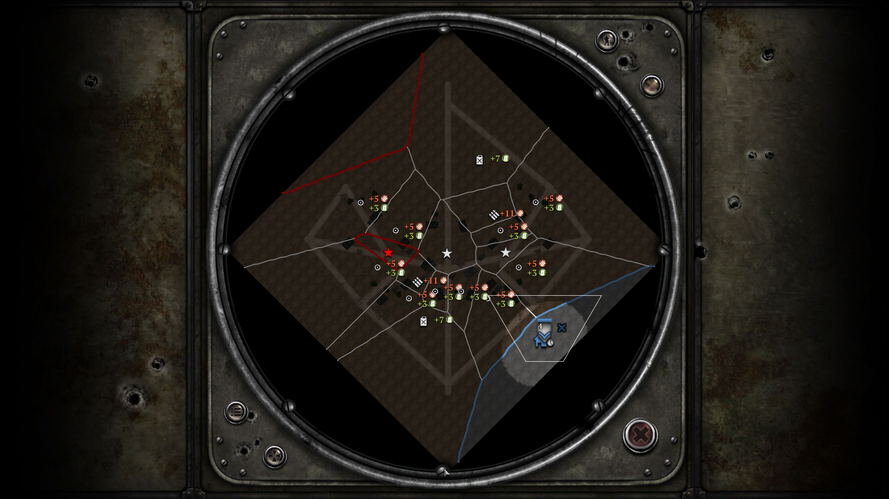

# 2p_codex_crossroads

COH2 1v1 欧洲小镇战斗地图。当前唯一续作入口是 `scenario/2p_codex_crossroads_rebuild_v4.sgb`；仓库保存的是 World Builder 生成的完整九文件同名 bundle，`package/2p_codex_crossroads_rebuild_v4.sga` 是本轮游戏内验收实际加载的封包。

## v4 修复结果

- 清除了旧高度图中约 4 m 深坑和 24 m 尖峰，重建为约 10–14 m 的连续地形：10 m 低地、12 m 镇区台地、14 m 侧翼高地，道路坡脚采用高 Feather 平滑。
- 路网改为西北—东南主街、两条侧翼乡道和南部回接，不再使用覆盖全图的硬直线交叉。
- 使用正式 Ardennes Rural 建筑、棚屋、树列与林篱；场景中不使用占位方块。
- 保留 19 个连续领地区、3 VP、2 油、2 弹药、10 个普通领地点，以及双方完整出生包和 entry point。
- 已在 COH2 自定义 1v1 中载入：玩家与 Easy AI 正常生成，基地、资源、领地边界和 VP 均显示。

## 证据

- `evidence/overhead-v4.png`：World Builder 俯视路网与建筑分布。
- `evidence/height-v4-contrast.png`：高度图对比增强图。
- `evidence/runtime-v4-tactical.jpg`：游戏内战术地图、出生与领地证据。
- `evidence/runtime-v4-town.jpg`：中央小镇实机视图。
- `evidence/runtime-v4-highland.jpg`：侧翼高地与连续坡面实机视图。
- `checksums.sha256`：九文件场景 bundle 与实机 `.sga` 的 SHA-256。

## 另一台电脑继续开发

1. 将 `scenario/` 内九个同 basename 文件一起复制到 COH2 模块允许的 `Data\Scenarios\<folder>`。
2. 在 World Builder 中打开 `2p_codex_crossroads_rebuild_v4.sgb`，不要只复制 `.sgb`。
3. 修改后使用新 basename 另存，生成完整 sidecar 与 `.sga`，再做游戏内 1v1 复验。

当前未宣称最终平衡完成：中型车辆三路全程和交换人工出生侧的长局仍需完成。
